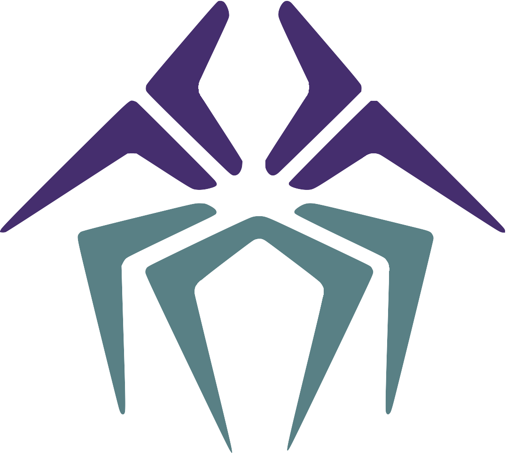

Welcome to my Github!

I'm Nicky Kriplani (he/him), a computer science student at NYU Tandon and member of the OSIRIS Lab. I've been happily coding since I was 8 and continue to learn more every day! Cybersecurity and game development will both instantly catch my attention and interest, but I'm happy to dig into any topic.

If you'd like to gain a sense of how I think, here's a [cybersecurity explainer video](https://www.youtube.com/watch?v=Mdeu__zgEUo) I made, which revolves around Github Copilot, a machine-learning-based code autocompletion tool. The video focuses on the security vulnerabilities that can arise from automatically generating code and how we could potentially prevent them, all with the intention to break these complex topics down into a simple, easily digestible format.

There are, of course, also a few tidbits in my repositories, so feel free to take a look; have a nice day!

