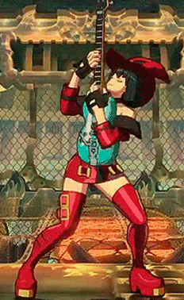

  
  
  

  
Hi there!
---

I'm Nicky Kriplani (he/him), a CS student at NYU Tandon. I've been coding since I was 8 and continue to learn more every day! In particular, I'm looking to learn about cybersecurity, game development, and machine learning, but I'm happy to dip my feet into any topic.

If you'd like to gain a sense of how I think, here's a [cybersecurity explainer video](https://www.youtube.com/watch?v=Mdeu__zgEUo) I made!

I'm still working on migrating the rest of my past projects onto Github, but feel free to take a look around; have a nice day!
